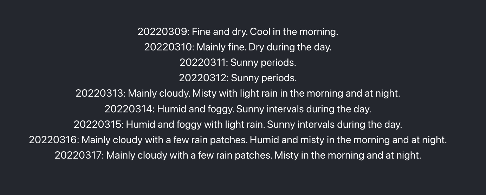

# ioio-interview-test

1. Node.js\
My attempt is to use aws's api gateway and and lambda(node14) to host the endpoint.
Code wise, I have use the native https package for minimal footprint, parsing the hko api with a reduce function.
The url of the endpoint is [here](https://oxihr4s9a6.execute-api.ca-central-1.amazonaws.com/prod/9daysweather), the example code is [here](./test1.js).

2. react\
The app is initialized with creat-react-app, using packages swr for fetching api and react-bootstrap for a spinner component.\

[example](https://ioio-test2.web.app/) is hosted on firebase for fast demonstration.

3. css\
The similar result is achived by changing display property of h1 tag from block to inline.

The app is initialized with vite for fast development speed, Deploy to firebase in which can be viewed [here](https://ioio-test3.web.app/).

4. three.js
The rgb effect is achived with ShaderPass.

Example can be viewed [here](https://ioio-test4.web.app).